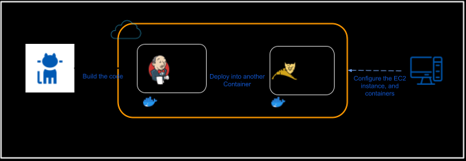

# CI/CD Deployment

Install Jenkins and Tomcat in separate containers residing on the same host EC2 instance. This is a step-by-step guide
that can be applied either on AWS EC2 or locally.



## Jenkins Setup

### Instructions

1. Launch EC2 instance
    1. Instance Type: Amazon Linux 2 AMI and t2.micro *(Free tier)*
    2. Configuration:
        1. Default VPC
        2. Public subnet
        3. Auto assigned public IP
        4. Allow `TCP` for ports `8080` and `80`
        5. Allow `SSH` for port `22`
    3. Download new `SSH` key-pair
2. Login to EC2 instance using `SSH`

```shell
$ ssh -i ./jdnd-sasa94s.pem ec2-user@54.190.125.190

       __|  __|_  )
       _|  (     /   Amazon Linux 2 AMI
      ___|\___|___|

https://aws.amazon.com/amazon-linux-2/
[ec2-user@ip-172-31-2-38 ~]$
```

3. Update packages

```shell
sudo yum update
```

4. Install Docker

```shell
sudo yum install docker
```

5. Add current user to `docker` user group

```shell
sudo usermod -a -G docker $USER
sudo reboot
```

6. Run Docker service

```shell
sudo service docker start
```

7. Check Docker engine is running

```shell
systemctl show --property ActiveState docker
```

8. Create and run Docker Container using [`jenkinsci/blueocean`](https://hub.docker.com/r/jenkinsci/blueocean/) Docker
   image.

```shell
docker run -u root -d --name jenkinsContainer -p 8080:8080 -v jenkins-data:/var/jenkins_home -v /var/run/docker.sock:/var/run/docker.sock -v "$HOME":/home jenkinsci/blueocean
```

9. Check Docker Container `jenkinsContainer` is running

```shell
docker ps
```

11. Open shell into Docker Container `jenkinsContainer`

```shell
docker exec -it jenkinsContainer bash
```

12. Install Maven

```shell
apk add maven
```

13. Create an RSA key-pair inside the Docker Container `jenkinsContainer`

```shell
ssh-keygen -t rsa
```

14. Place public key `id_rsa.pub` into GitHub account

```shell
cat /root/.ssh/id_rsa.pub
```

15. Login to Jenkins console on port `8080`, Go to http://54.190.125.190:8080, Get initial password

```shell
cat /var/jenkins_home/secrets/initialAdminPassword
```


16. Place private key `id_rsa` into Jenkins console

```shell
cat /root/.ssh/id_rsa
```

17. Install `Maven Integration` and `Deploy to container` plugins
    
18. Open shell into `jenkinsContainer` Docker Container

```shell
docker exec -it jenkinsContainer bash
```

19. Go to `Manage Jenkins` -> `Global Tool Configurations` settings
    
    1. Add Maven Path from below:
       ```shell
       mvn -version
       ```
       
    2. Add Java Path from below:
       ```shell
       java -version
       echo $JAVA_HOME
       ```
       

## Tomcat Setup

Install Tomcat on a new container residing on the same EC2 host instance

### Instructions

1. Set Firewall rules: open `TCP` for port `8888`, Go to Security tab -> Edit Security Group -> Edit Inbound Rules
2. Create and run Docker Container [`tomcat`](https://hub.docker.com/_/tomcat)

```shell
docker run -dit --name tomcatContainer -p 8888:8080 tomcat:9.0
```

3. Check running Docker containers

```shell
docker ps
```

4. Open bash into the Docker container `tomcatContainer`

```shell
docker exec -it tomcatContainer bash
```

5. (Optional) Copy Welcome Page of Tomcat

```shell
cp -r webapps.dist/* webapps
```

7. Update packages

```shell
apt-get update
```

8. Install VIM to edit files

```shell
apt-get install vim
```

9. Edit `tomcat-users.xml` file

```shell
vi conf/tomcat-users.xml
```

10. Add the below roles and assign them to `admin` user, include it inside `<tomcat-users>` tag.

```xml

<role rolename="admin-gui"/>
<role rolename="manager-gui"/>
<role rolename="manager-script"/>
<user username="admin" password="admin" roles="admin-gui, manager-gui, manager-script"/>
```

11. Edit `context.xml` file

```shell
find -name context.xml
vi ./webapps/manager/META-INF/context.xml
```

12. Comment out the below:

```xml

<Valve className="org.apache.catalina.valves.RemoteAddrValve"
       allow="127\.\d+\.\d+\.\d+|::1|0:0:0:0:0:0:0:1"/>
```

13. Restart Tomcat Server

```shell
bin/shutdown.sh
```

14. Start `tomcatContainer` Docker Container

```shell
docker start tomcatContainer
```


## Finalizing

### Docker Network

1. List current networks
   ```shell
   docker network ls
   ```
2. Inspect `bridge` network to see what containers are connected along with their Private IPs
   ```shell
   docker network inspect bridge
   ```

### Jenkins

Go to Jenkins Console, Create Freestyle Job

1. Add GitHub project URL
2. Check Git from Source Code Management, Add GitHub Repository URL, Choose Credentials
3. Check `Poll SCM`, and add Schedule `* * * * *`
4. Check `Delete workspace before build starts`
5. Check `Abort the build if it's stuck` -> Set `Timeout minutes` to `20`
6. Check `Add timestamps to the Console Output`
7. Click `Add build step` -> `Invoke top-level Maven targets`
    1. Check Version
    2. Add Goal `clean compile package`
    3. Choose POM file relative to repository home
8. Click `Add post-build action` -> `Deploy war/ear to a container`
    1. Add WAR/EAR files `**/*.war`
    2. Add Context path `eCommerceApp`
    3. Click `Add container` -> `Tomcat v9.x`
        1. Add Tomcat URL (Private IP): `http://172.17.0.3:8080`
        2. Add Manager URL (Private IP): `http://172.17.0.3:8080/manager/html`
        3. Add Credentials -> Global Credentials -> Username and Password -> `admin` : `admin`

## Build Output

### Success Build


### Console Outputs

Sample of a Build Console Output can be found [here](ci-cd/jenkins_console-output-sample.log).


