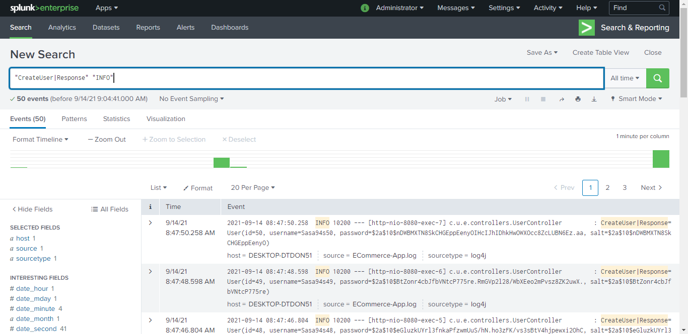
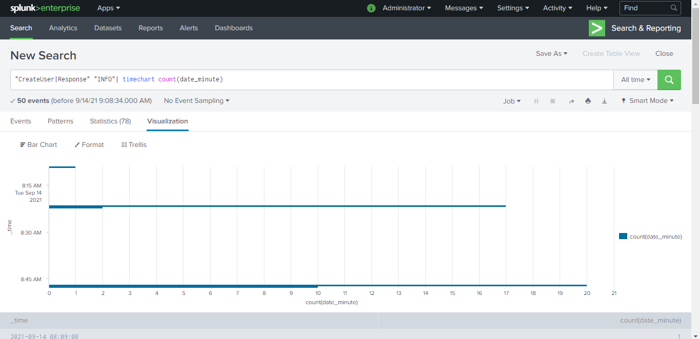
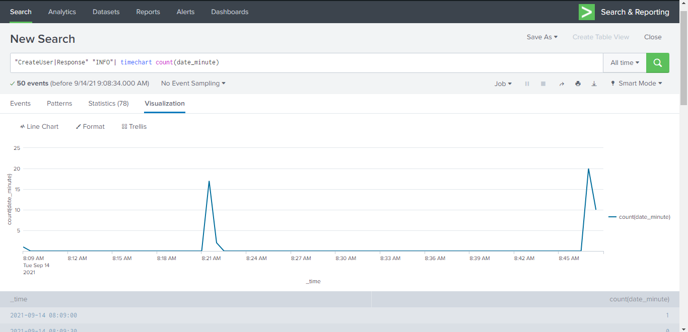
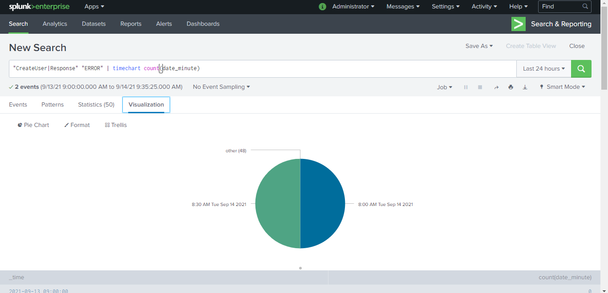
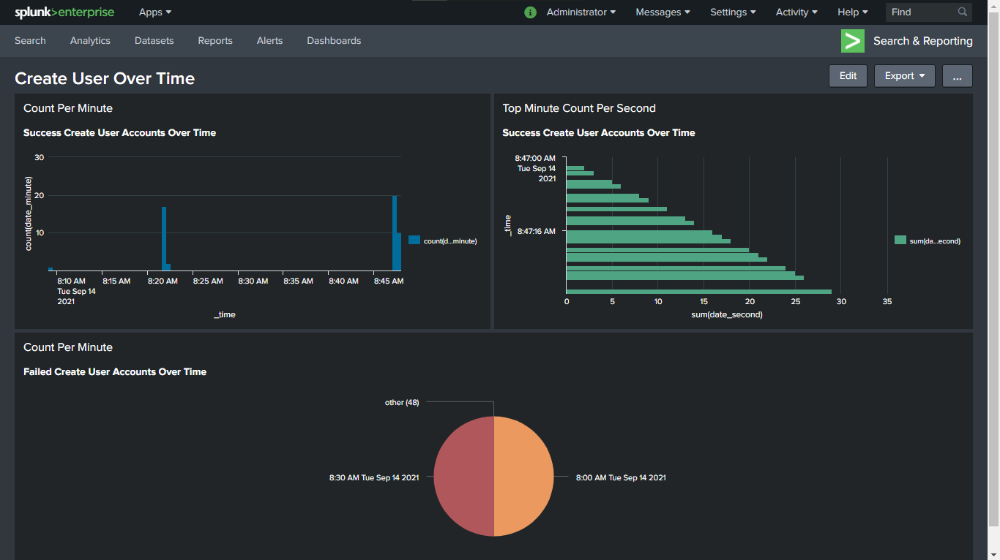

# Splunk

Indexed logs for monitoring, analyzing and visualizing user activities such as Accounts Creation.

> Full logs is available as [Text](logs/ECommerce-App.log) for view/download.

## Search

Filter logs by `CreateUser` success responses

## Visualizing

### Bar Chart

Number of successfully created user accounts per minute.

### Line Chart

Number of successfully created user accounts per minute.

### Pie Chart

Number of failed created user accounts per second. _(Only 2 occurrences)_

## Putting All Together

Created User Over Time Dashboard. A Dashboard that contains three charts: Bar Chart, Column Chart, and Pie Chart.
> Dashboard is available as [PDF](logs/Dashboard_create-user-over-time_2021-09-14.pdf) for view/download.

